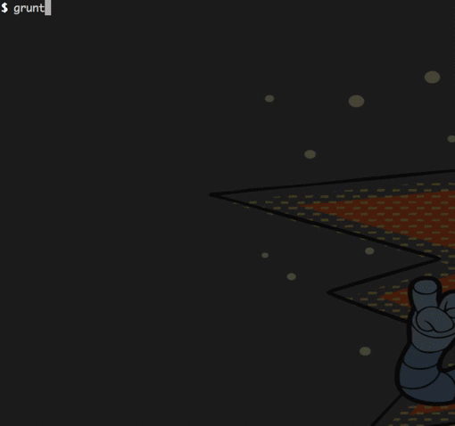

# grunt-warn-friday

> Grunt to warn developers of a Friday deployment

[](https://travis-ci.org/dinks/grunt-warn-friday)




## Getting Started
This plugin requires Grunt `~0.4.5`

If you haven't used [Grunt](http://gruntjs.com/) before, be sure to check out the [Getting Started](http://gruntjs.com/getting-started) guide, as it explains how to create a [Gruntfile](http://gruntjs.com/sample-gruntfile) as well as install and use Grunt plugins. Once you're familiar with that process, you may install this plugin with this command:

```shell
npm install grunt-warn-friday --save-dev
```

Once the plugin has been installed, it may be enabled inside your Gruntfile with this line of JavaScript:

```js
grunt.loadNpmTasks('grunt-warn-friday');
```

## The "warn_friday" task

### Overview
In your project's Gruntfile, add a section named `warn_friday` to the data object passed into `grunt.initConfig()`.

```js
grunt.initConfig({
  warn_friday: {
    options: {
      // Task-specific options go here.
    },
    your_target: {
      // Target-specific file lists and/or options go here.
    },
  },
});
```

### Options

#### options.friday
Type: `Number`

Default value: 5

The value considered to be a Friday. Something between 0 and 6. See [MDN](https://developer.mozilla.org/en-US/docs/Web/JavaScript/Reference/Global_Objects/Date).

#### options.aggressive
Type: `Boolean`

Default value: `true`

Causes the task to fail if the deployment falls on a given `options.friday`.

#### options.warningTemplate
Type: `String`

Default value: `'templates/deploy_friday.txt'`

A String value which points to the template to show when the deployments **falls** on a given `options.friday`.

#### options.warningColor
Type: `String`

Default value: `red`

Color of the warning message.

#### options.okTemplate
Type: `String`

Default value: `'templates/all_ok.txt'`

A String value which points to the template to show when the deployments **does not fall** on a given `options.friday`.

#### options.okColor
Type: `String`

Default value: `green`

Color of the 'all ok' message.

### Usage Examples

#### Default Options

Use with the options defined above!

## Contributing
In lieu of a formal styleguide, take care to maintain the existing coding style. Add unit tests for any new or changed functionality. Lint and test your code using [Grunt](http://gruntjs.com/).

## Release History

*01/03/2015* Version **[0.1.0](https://github.com/dinks/grunt-warn-friday/releases/tag/v0.1.0)**
